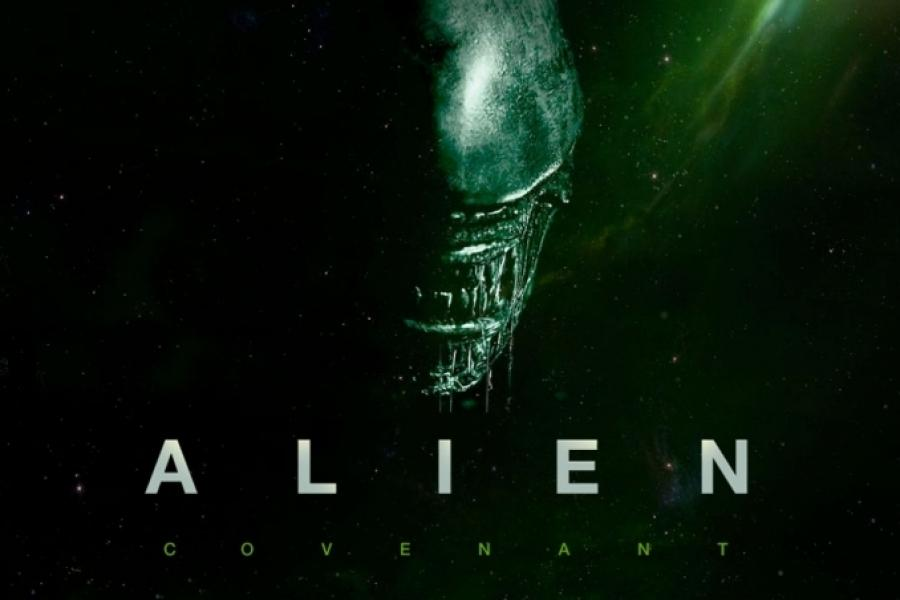

# hellow-word
actividad 1b hellow-word
<!DOCTYPE HTML PUBLIC "-//W3C//DTD HTML 4.0 Transitional//EN">
<html>
<head>
    <meta http-equiv="content-type" content="text/html; charset=windows-1252"/>
    <title>hellow word</title>
    <meta name="generator" content="LibreOffice 5.3.4.2 (Windows)"/>
    <meta name="created" content="00:00:00"/>
    <meta name="changed" content="2020-09-28T18:21:26.394000000"/>
    
</head>
<body lang="ca-ES" dir="ltr">

<h1 class="western" style="background: #DB1603"><em>Alien</em></h1>

<main>
<h3 class="western" style="background: #25F01D "><em>Alien pelicula de ciencia ficcion</em></h3>
<article>

<strong>Alien &eacute;s una pel&middot;l&iacute;cula de
ci&egrave;ncia-ficci&oacute; de l'any 1979 dirigida per Ridley Scott</strong>
&Eacute;s la primera part d'una saga de quatre pel&middot;l&iacute;cules
que tenen com a protagonista a Ellen Ripley, interpretada per
Sigourney Weaver, que es converteix en la principal oponent d'una
s&egrave;rie de criatures pertanyents a una ra&ccedil;a alien&iacute;gena,
comunament anomenades aliens. Alien es considera la primera
pel&middot;l&iacute;cula important de Hollywood amb una hero&iuml;na
com a protagonista. El seu impacte cultural va ser tan gran que es
van fer novel&middot;les i historietes, basats en la seva hist&ograve;ria.
Aquesta pel&middot;l&iacute;cula ha estat doblada al catal&agrave;.

</article>

Alien va rebre un gran acolliment per la cr&iacute;tica i un gran
&egrave;xit de taquilla, rebent un Premi als Millors Efectes Visuals,
un Premi Saturn a la Millor Pel&middot;l&iacute;cula de
Ci&egrave;ncia-ficci&oacute;, un Premi Saturn a la Millor Direcci&oacute;
per Ridley Scott i un Premi Saturn a la Millor Actriu de Repartiment
per Cartwright, aix&iacute; com moltes altres nominacions.

<em>Ha estat molt elogiada en les d&egrave;cades posteriors, sent
introdu&iuml;da en el Registre Nacional de Cinema de la Biblioteca
del Congr&eacute;s dels Estats Units en el 2002 per a preservaci&oacute;
hist&ograve;rica com una pel&middot;l&iacute;cula que &eacute;s
&quot;cultural, hist&ograve;rica i est&egrave;ticament
significativa&quot;, sent classificada per l'American Film Institute
en el 2008 com la setena millor pel&middot;l&iacute;cula en el g&egrave;nere
de la ci&egrave;ncia-ficci&oacute;. </em>

<em>he estraido esta informacion de</em>

<em><a href="https://ca.wikipedia.org/wiki/Alien">wikipedia</a> </em>

<h2 class="western" style="background: #6a5acd"><em>alien vs predator</em></h2>

<em>

</em>

<em>Alien vs. Predator (en espa&ntilde;ol Alien vs. Depredador) es
una pel&iacute;cula de ciencia ficci&oacute;n dirigida por Paul W. S.
Anderson, producida por 20th Century Fox y estrenada en 2004. La
pel&iacute;cula es heredera de la influencia de las series
cinematogr&aacute;ficas iniciadas con las pel&iacute;culas Alien
(1979) y Predator (1987), a partir de un concepto originado en un
c&oacute;mic de Dark Horse de 1989 y pasando por un videojuego de
1994. Anderson, Dan O'Bannon y Ronald Shusett escribieron la historia
mientras que Anderson y Shane Salerno adaptaron el guion. Estuvieron
influidos por la mitolog&iacute;a azteca, la serie de c&oacute;mics y
los escritos de Erich von D&auml;niken.</em>

<em>&lt;blockquote&gt;</em><em>Ambientada en 2004, la pel&iacute;cula
sigue a un grupo de paleont&oacute;logos, arque&oacute;logos y otros,
reunidos por el multimillonario Charles Bishop Weyland (Lance
Henriksen) para una expedici&oacute;n cerca de la Ant&aacute;rtida
para investigar una se&ntilde;al de calor misterioso.

Weyland espera
para reclamar como suyo el hallazgo, y su grupo descubre una pir&aacute;mide
debajo de la superficie de una abandonada estaci&oacute;n de caza de
ballenas.

 
Los jerogl&iacute;ficos y esculturas revelan que la
pir&aacute;mide es un coto de caza para los depredadores que matan a
los aliens como un rito de pasaje.

<em>Los seres humanos est&aacute;n
atrapados en medio de una batalla entre las dos especies y tratar de
evitar que los Aliens lleguen a la superficie.</em><em>&lt;/blockquote&gt;</em>

tambien exiten videojuegos sobre esta saga los cuales recomiendo jugarAlien es un juego lento con gran carga de suspense,
que utiliza gráficos muy simples en negro y verde, con un poco de color extra para algunos textos y para la ubicación de los personajes.
Un menú omnisciente conduce el juego, a través del cual el jugador se pone a cargo de todos los miembros de la tripulación de la Nostromo.
El juego comienza con la muerte de uno de los miembros de la tripulación, que refleja la muerte de Kane cuando da a luz al xenomorfo en la película.
El jugador mueve los personajes en una representación en una cuadrícula del mapa de la nave mientras buscan al alien. 
En el mapa hay varios objetos que son útiles como redes, incineradores, pistolas y tanques de oxígeno. 
El jugador puede ordenar a uno de los miembros de la tripulación que recoja tales objetos y los use cuando sea necesario.

juegos como alien vs predators o otros como alien colonial marines sobre el cual os dejo el link en la imagen de abajo

en caso de que el link de la imagen no funcione debajo os dejo una tabla sobre algunos videojuegos

<table style="width:100%">
<tr>
    <th>videojuegos de alien</th>
  </tr>
  <tr>
    <td>Alien the computer gamer</td>
    <td>Alien 2</td>
    <td>Alien 3 the gun</td>
  </tr>
  <tr>
    <td>Alien vs predator 2 (psp)</td>
    <td>Alien vs predator</td>
    <td>Alien colonial marines</td>
  </tr>
</table>

Algunos ejemplos de los videojuegos

<audio controls>
<source src="alienmotion.mp3" type="audio/mpeg">
</audio>

<video width="320 height="248" controls>
<source src="https://www.youtube.com/watch?v=fOZ_lAClH0o" type="video/mp4"
</video>

<h3 class="western"><em>comentario</em></h3>

<em>recomiendo esta pelicula porque la he visto y realmente me
parece increible.</em>

</body>
</html>
